# Database ER Diagram

> Auto-derived from [`supabase/migrations/00000000000000_schema.sql`](../supabase/migrations/00000000000000_schema.sql).
> Update this diagram whenever a new table or foreign key is added.

The diagram below uses Mermaid's `erDiagram` syntax. GitHub, VS Code, and most
markdown viewers render it natively.

```mermaid
erDiagram
    %% ============================================================
    %% Candidate-centric core
    %% ============================================================
    candidates ||--o{ experiences           : "has work history"
    candidates ||--o{ education             : "has degrees"
    candidates ||--o{ candidate_languages   : "speaks"
    candidates ||--o{ skills                : "claims"
    candidates ||--o{ candidate_tags        : "tagged with"
    candidates ||--o{ candidate_notes       : "HR notes"
    candidates ||--o{ job_applications      : "applies to"
    candidates ||--o{ job_matches           : "ranked for"
    candidates ||--o{ job_shortlists        : "shortlisted on"
    candidates ||--o{ assessments           : "takes"
    candidates ||--o{ interview_sessions    : "runs"
    candidates ||--o{ improvement_tracks    : "owns"
    candidates ||--o{ notifications         : "receives"
    candidates ||--|| notification_preferences : "configures"

    %% ============================================================
    %% Job-centric flows
    %% ============================================================
    jobs ||--o{ job_applications : "receives"
    jobs ||--o{ job_matches      : "ranks"
    jobs ||--o{ job_shortlists   : "shortlists for"
    jobs ||--o{ assessments      : "scoped to"
    jobs ||--o{ assessment_templates : "uses"
    jobs ||--o{ notifications    : "context for"

    %% ============================================================
    %% Assessments & interviews
    %% ============================================================
    assessment_templates ||--o{ assessments       : "instantiated as"
    assessments          ||--|| assessment_results : "produces"
    interview_sessions   ||--o{ interview_transcript_turns   : "records"
    interview_sessions   ||--o{ interview_proctoring_events  : "logs"

    %% ============================================================
    %% Improvement & comms
    %% ============================================================
    improvement_tracks ||--o{ improvement_progress : "tracks"
    promo_campaigns    ||--o{ notifications        : "drives"

    %% ============================================================
    %% Ambassador Program
    %% ============================================================
    ambassador_programs    ||--o{ ambassador_applications : "receives"
    candidates             ||--o{ ambassador_applications : "submits"

    %% ============================================================
    %% Candidate Segments
    %% ============================================================
    candidate_segments     ||--o{ candidate_segment_members : "contains"
    candidates             ||--o{ candidate_segment_members : "member of"

    %% ============================================================
    %% Standalone / ops tables (no FK in/out shown for brevity)
    %% ============================================================
    %% scoring_weights, scoring_presets, sync_jobs, parsing_jobs,
    %% hr_dashboard_widgets, jd_parsing_telemetry, hr_profiles

    candidates {
        TEXT id PK
        UUID user_id FK "auth.users"
        TEXT email
        TEXT full_name
        TEXT status
        TEXT origin
        BOOLEAN shortlisted "watchlist"
        NUMERIC overall_cv_score
        TIMESTAMPTZ created_at
        TIMESTAMPTZ updated_at
    }
    jobs {
        TEXT id PK
        TEXT title
        TEXT department
        TEXT location
        TEXT job_type
        TEXT source_url
        JSONB parsed_requirements
        INT parsed_requirements_version
        TIMESTAMPTZ created_at
    }
    experiences {
        TEXT id PK
        TEXT candidate_id FK
        TEXT company
        TEXT title
        DATE start_date
        DATE end_date
        TEXT[] fields_of_work
    }
    education {
        TEXT id PK
        TEXT candidate_id FK
        TEXT institution
        TEXT degree
        TEXT field
    }
    candidate_languages {
        TEXT id PK
        TEXT candidate_id FK
        TEXT language
        TEXT cefr_level
    }
    skills {
        TEXT id PK
        TEXT candidate_id FK
        TEXT name
        INT years
    }
    candidate_tags {
        TEXT id PK
        TEXT candidate_id FK
        TEXT tag
    }
    candidate_notes {
        TEXT id PK
        TEXT candidate_id FK
        TEXT body
        TEXT author
    }
    job_applications {
        TEXT id PK
        TEXT job_id FK
        TEXT candidate_id FK
        TEXT status
        TIMESTAMPTZ applied_at
    }
    job_matches {
        TEXT id PK
        TEXT job_id FK
        TEXT candidate_id FK
        NUMERIC match_score
        BOOLEAN is_eligible
        JSONB breakdown
    }
    job_shortlists {
        TEXT id PK
        TEXT job_id FK
        TEXT candidate_id FK
        TEXT added_by
        NUMERIC fit_score_at_add
        TEXT notes
    }
    hr_dashboard_widgets {
        TEXT id PK
        UUID user_id "auth.users"
        TEXT title
        JSONB spec
        INT position
    }
    assessment_templates {
        TEXT id PK
        TEXT name
        TEXT job_id FK
        JSONB structure
    }
    assessments {
        TEXT id PK
        TEXT candidate_id FK
        TEXT job_id FK
        TEXT template_id FK
        TEXT status
    }
    assessment_results {
        TEXT id PK
        TEXT assessment_id FK "UNIQUE"
        NUMERIC score
        TEXT final_decision
        JSONB evaluation_rationale
    }
    interview_sessions {
        TEXT id PK
        TEXT candidate_id FK
        TEXT interview_mode "TECHNICAL or LANGUAGE"
        TEXT target_skill
        TEXT token_hash
        TEXT status
    }
    interview_transcript_turns {
        TEXT id PK
        TEXT interview_id FK
        TEXT speaker
        TEXT content
        TIMESTAMPTZ at
    }
    interview_proctoring_events {
        TEXT id PK
        TEXT interview_id FK
        TEXT event_type
        JSONB details
    }
    improvement_tracks {
        TEXT id PK
        TEXT candidate_id FK
        TEXT focus_area
        TEXT status
    }
    improvement_progress {
        TEXT id PK
        TEXT track_id FK
        TEXT milestone
        BOOLEAN done
    }
    notifications {
        TEXT id PK
        TEXT job_id FK
        TEXT candidate_id FK
        TEXT campaign_id FK
        TEXT type
        TEXT message
        TIMESTAMPTZ read_at
        TEXT created_by
        JSONB metadata
    }
    notification_preferences {
        TEXT id PK
        TEXT candidate_id FK "UNIQUE"
        BOOLEAN email_enabled
        BOOLEAN push_enabled
    }
    promo_campaigns {
        TEXT id PK
        TEXT title
        TEXT status
        TIMESTAMPTZ scheduled_at
    }
    ambassador_programs {
        TEXT id PK
        TEXT title
        TEXT description
        TEXT cohort
        TIMESTAMPTZ application_deadline
        TEXT location
        TEXT country
        TEXT requirements
        TEXT perks
        TEXT status "DRAFT/OPEN/CLOSED"
        INT max_applicants
    }
    ambassador_applications {
        TEXT id PK
        TEXT program_id FK
        TEXT candidate_id FK
        TEXT status "SUBMITTED/UNDER_REVIEW/ACCEPTED/REJECTED"
        TEXT motivation
        TEXT university
        INT year_of_study
        TEXT previous_experience
        TEXT pitch_video_url
        TIMESTAMPTZ applied_at
    }
    candidate_segments {
        TEXT id PK
        TEXT name
        TEXT description
        TEXT created_by
    }
    candidate_segment_members {
        TEXT segment_id FK
        TEXT candidate_id FK
    }
    hr_profiles {
        TEXT id PK
        UUID user_id "auth.users"
        TEXT full_name
        TEXT department
        TEXT phone
    }
    jd_parsing_telemetry {
        TEXT id PK
        TEXT job_id FK
        TEXT provider
        TEXT model
        BOOLEAN success
        INT duration_ms
        BOOLEAN fallback_used
        TEXT error_kind
    }
```

## Cardinality summary

| From → To | Type | On delete |
|---|---|---|
| `candidates` → `experiences` | 1 → many | CASCADE |
| `candidates` → `education` | 1 → many | CASCADE |
| `candidates` → `candidate_languages` | 1 → many | CASCADE |
| `candidates` → `skills` | 1 → many | CASCADE |
| `candidates` → `candidate_tags` | 1 → many | CASCADE |
| `candidates` → `candidate_notes` | 1 → many | CASCADE |
| `candidates` → `job_applications` | 1 → many | CASCADE |
| `candidates` → `job_matches` | 1 → many | CASCADE |
| `candidates` → `job_shortlists` | 1 → many | CASCADE |
| `candidates` → `assessments` | 1 → many | CASCADE |
| `candidates` → `interview_sessions` | 1 → many | CASCADE |
| `candidates` → `improvement_tracks` | 1 → many | CASCADE |
| `candidates` → `notifications` | 1 → many | CASCADE |
| `candidates` → `notification_preferences` | 1 → 1 | CASCADE |
| `jobs` → `job_applications` | 1 → many | CASCADE |
| `jobs` → `job_matches` | 1 → many | CASCADE |
| `jobs` → `job_shortlists` | 1 → many | CASCADE |
| `jobs` → `assessment_templates` | 1 → many | (none) |
| `jobs` → `assessments` | 1 → many | (none) |
| `jobs` → `notifications` | 1 → many | CASCADE |
| `assessment_templates` → `assessments` | 1 → many | (none) |
| `assessments` → `assessment_results` | 1 → 1 | CASCADE |
| `interview_sessions` → `interview_transcript_turns` | 1 → many | CASCADE |
| `interview_sessions` → `interview_proctoring_events` | 1 → many | CASCADE |
| `improvement_tracks` → `improvement_progress` | 1 → many | CASCADE |
| `promo_campaigns` → `notifications` | 1 → many | SET NULL |
| `auth.users` → `candidates.user_id` | 1 → 1 | SET NULL |
| `auth.users` → `hr_dashboard_widgets.user_id` | 1 → many | (none) |
| `ambassador_programs` → `ambassador_applications` | 1 → many | CASCADE |
| `candidates` → `ambassador_applications` | 1 → many | CASCADE |
| `candidate_segments` → `candidate_segment_members` | 1 → many | CASCADE |
| `candidates` → `candidate_segment_members` | 1 → many | CASCADE |
| `auth.users` → `hr_profiles.user_id` | 1 → 1 | (none) |
| `jobs` → `jd_parsing_telemetry.job_id` | 1 → many | CASCADE |

## Tables without inbound or outbound FKs

- `scoring_weights`, `scoring_presets` — config singletons
- `sync_jobs`, `parsing_jobs` — async job logs
- `hr_profiles` — HR user profile (FK to `auth.users`)
- `jd_parsing_telemetry` — fire-and-forget telemetry (FK to `jobs`)
