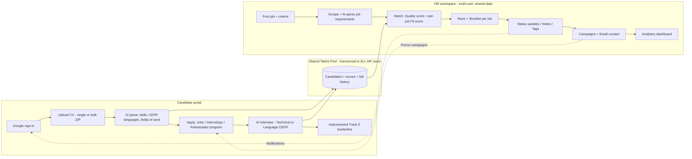

# TalentHub — Final Presentation Handoff

> **For:** Designer (slide build) + Presenter (5-minute speech)
> **Format:** 6 slides · ~5 minutes · max 4 screenshots
> **Context:** Presentation takes place **at the adidas center** — so we keep client background minimal and avoid re-explaining adidas to adidas.

---

## How to use this document

Each slide block has three parts:
- **On slide** → what the designer puts on the slide (titles, bullets, tables, diagram).
- **You say** → compact speaker script (read/adapt naturally).
- **Screenshot** → where a screenshot goes (only 4 total).

Authoritative numbers come from the near-final LaTeX report. **Use these exact figures:**

| Metric | Value |
|---|---|
| Database tables | **33** |
| API endpoints | **66** |
| Automated tests | **305** (across 18 files) |

---

## SLIDE 1 — Title + value proposition (~25s)

**On slide:**
- Title: **TalentHub — Talent Intelligence & Language Verification Platform**
- One line: *AI-assisted screening + a persistent, verified talent pool for a multilingual workforce*
- Badge: `Live · adidas-pool.vercel.app`

**You say:**
> "TalentHub is a working prototype that takes a recruiter from a pile of raw CVs to a ranked, language-verified shortlist — and keeps every candidate in a persistent, shared talent pool. Let me walk you through what it does and how it's built."

---

## SLIDE 2 — Needs → What we delivered (~55s)

**On slide:** grouped 2-column table.

| Recruitment need | What we built |
|---|---|
| **Ingest at scale** | Single + **bulk ZIP** CV upload, async parsing pipeline |
| **Structure raw CVs** | AI extraction → skills, **CEFR languages**, experience, education, 16 canonical *fields of work* |
| **Verify language objectively** | AI interview scoring spoken English on the **CEFR rubric** |
| **Rank fairly** | Two transparent scores: **Quality** (CV-intrinsic) + per-job **Fit** (7 criteria) |
| **Manage candidates** | Status lifecycle, tags, recruiter notes, **watchlist**, per-job **shortlists** |
| **Full audit trail** | Per-candidate **interaction history** — every status change, email, campaign |
| **Engage talent** | **Email contact**, **promo campaigns**, **notifications**, candidate **segments** |
| **Beyond hiring** | **Internship** applications (motivation letter + learning agreement) & **Ambassador program** portal |
| **Develop borderline talent** | **Improvement tracks** auto-created on a failed assessment |
| **Decide with data** | Analytics dashboard — 7 default charts + a **custom chart builder** |

**You say:**
> "The core is parse, score, rank — but it goes much wider. HR gets full candidate lifecycle management: status tracking, notes, shortlists per job, a complete interaction audit trail, plus engagement tools like email, campaigns and notifications. And it's not only full-time hiring — there are dedicated flows for internships and a brand-ambassador program. Crucially, all of this data is shared across every HR user."

**Must-say note:** *transparent, deterministic scoring — not black-box AI; humans always decide.*

---

## SLIDE 3 — App flow diagram (Candidate + HR + shared pool) (~70s) ⭐ centerpiece

**On slide:** render this diagram large — this is the slide you spend the most time on.

**You say:**
> "Two sides feeding one shared pool. A candidate signs in, uploads a CV that AI parses into skills and CEFR languages, then applies — not just to jobs, but to internships and the ambassador program — and can take an AI interview. On the HR side, a recruiter posts a job, the system parses its requirements, and every candidate gets two scores: a Quality score that's CV-intrinsic, and a Fit score computed live against *that specific* job across seven criteria. HR ranks, shortlists, updates status, and engages via campaigns and notifications. The key point: this pool and all candidate history is **transversal across every HR user** — one shared, consistent source of truth."

---

## SLIDE 4 — The AI Interviewer (teammate's part) (~50s) 📸 Screenshot #1

**On slide:** interview screenshot · badges `Technical mode` · `Language / CEFR mode`.

**You say:**
> "The standout — built by [teammate] — is the AI Interviewer, in two modes: a Technical mode that probes a chosen skill, and a Language mode that scores spoken English on the CEFR scale. Beyond verification, it plays three roles: it acts as an automated **first screening**, it hands HR **extra structured signal** they wouldn't get from a CV alone, and it's a way to **keep borderline candidates engaged** — a near-miss isn't rejected, it's routed into an improvement track. That last part is designed but not fully implemented yet."

---

## SLIDE 5 — Tech stack + real scale (~45s) 📸 Screenshot #2 (HR ranking view)

**On slide:**
- **Frontend:** Next.js 16 · React 19 · shadcn/ui · Tailwind
- **Architecture:** Onion / Clean Architecture (TypeScript)
- **Data/Auth/Storage:** Supabase — PostgreSQL, Google OAuth
- **AI:** Groq (Llama 3.3 70B) primary · OpenAI GPT-4o fallback
- **AI Interview backend:** FastAPI (Python) + speech-to-text/TTS
- **Hosting:** Vercel
- **Scale chips:** `33 database tables · 66 API endpoints · 305 automated tests`
- One line: *Provider-agnostic — matching core needs no LLM; AI flows can re-point to a self-hosted Llama with one adapter change.*

**You say:**
> "It's a cloud-native stack — Next.js and Supabase on Vercel — built on Clean Architecture, so business logic never depends on the database or the AI provider; we actually swapped our entire database mid-project with minimal pain. Concretely: 33 tables, 66 API endpoints, and 305 automated tests running in CI on every push. And it's provider-agnostic — the matching core has no AI dependency at all, while the AI flows run on free-tier models today but can be re-pointed to a self-hosted Llama with a single adapter change. So this could run entirely inside adidas."

---

## SLIDE 6 — vs State of the art → what adidas can adopt (~55s)

**On slide:** "Market gap → Our response" table.

| Market gap | TalentHub's response |
|---|---|
| Matching is opaque / workflow-centric | Pure, unit-tested **Fit** function, per-criterion breakdown |
| Language is self-declared | **Dual-mode CEFR AI interview** with sub-scores |
| Compliance bolted on afterwards | **GDPR deletion-aware schema + full audit trail** |
| LLM output unreliable for parsing | Strict tolerant validation + **provider fallback** |
| Intelligence tools assume big budgets | **Free-tier / self-hostable**, provider-agnostic |

**Then — "It's a prototype adidas can tune & adopt":**
- **Tunable** scoring weights · improve **JD parsing** (adidas *owns* that data internally — we only scrape the public listings to compare)
- **Two adoption paths:** a **screening front-end** *before* the ATS · or a **talent-pool management backend** that **integrates with SAP SuccessFactors** (we complement it, never replace it)
- **Run it on adidas's own AI** — CV parsing, job-matching and the AI interviewer can point to an **internal/self-hosted model** instead of public LLMs
- **Data stays in-house** — keeps every candidate's data inside adidas (**GDPR**) and removes per-call API cost

**You say:**
> "Against the state of the art, our edge is transparency and verification — most tools are opaque black boxes that trust self-reported language levels, and treat compliance as an afterthought; we built explainable scoring, real CEFR verification, and GDPR-aware data from the schema up. As a prototype, the scoring is tunable, and the job-description parsing would sharpen a lot internally — adidas owns that data, we only scrape the public listings. There are two ways to pick this up: as a screening front-end *before* SAP SuccessFactors, or as a candidate talent-pool backend that integrates with it. We complement the ATS — we don't replace it."

**Closing line:**
> "In short: TalentHub turns raw CVs into a ranked, language-verified, fully auditable talent pool — and it's live in production today."

---

## Screenshot shortlist (max 4)

1. **AI Interview screen** (Slide 4) — most impressive, teammate's work
2. **HR candidate ranking / Fit score** (Slide 5) — shows the intelligence
3. *(optional)* **Analytics dashboard** — polish & breadth
4. *(optional)* **Candidate profile w/ interaction history** — shows the audit trail

---

## Must-say checklist (don't leave the stage without these)

- Real numbers: **33 tables / 66 endpoints / 305 tests**
- Transparent/deterministic scoring, **not** black-box; **humans decide**
- **Two scores:** Quality vs Fit
- Data is **transversal across all HR users**
- AI interview = **first screening + extra HR signal + borderline engagement** (improvement tracks not fully done)
- **GDPR deletion-aware + audit trail** (strong to say *at* adidas)
- **Provider-agnostic / self-hostable** AI
- Prototype → complements **SAP SuccessFactors** as a **screening front-end** *or* a **talent-pool backend**
- Credit your teammate for the **AI Interviewer**
- It's **live in production** on Vercel
